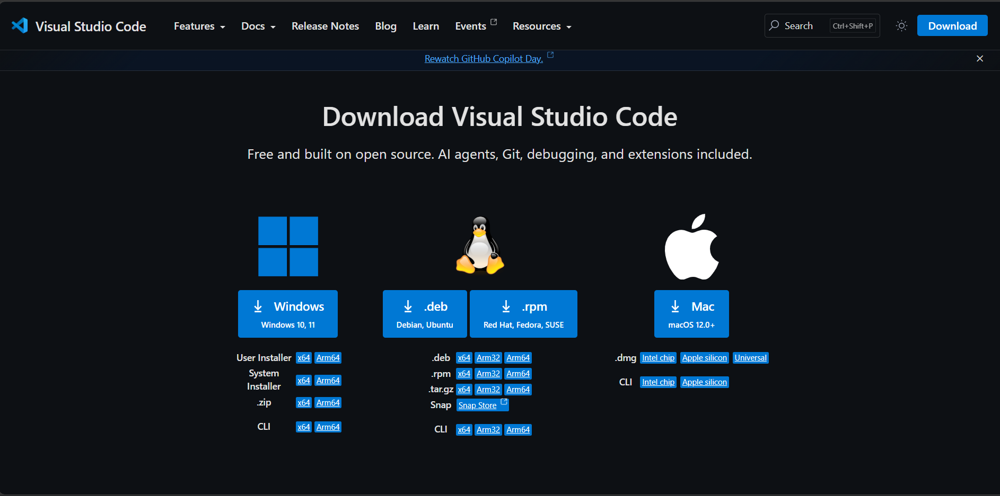
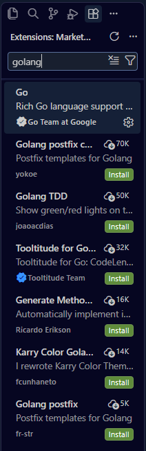
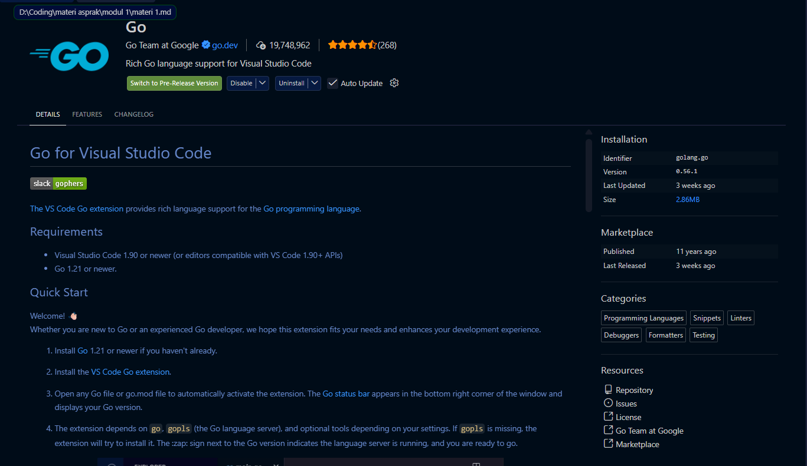
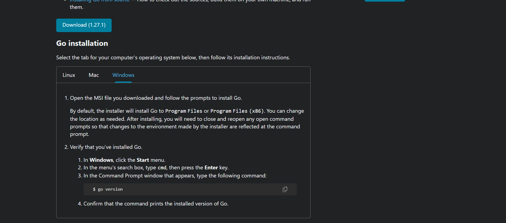
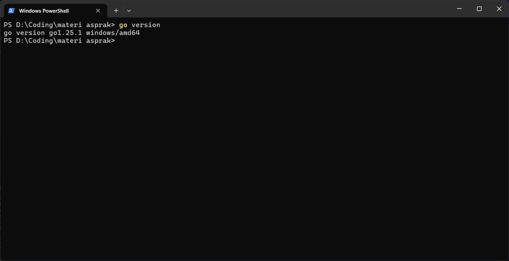

# Tugas pendahuluan minggu pertama praktikum algoritma pemrograman.
* menyiapkan code editor (vscode, dll.).
* bahasa go

Code editor VSCode: https://code.visualstudio.com/download?_exp_download=fb315fc982

Golang/Go         : https://go.dev/doc/install

## Steps instalasi VSCode :
1. Download VSCode 
2. Install VSCode 
3. Buka aplikasi VSCode
4. Download extention golang  

## Steps instalasi Golang :
1. Download Golang 
2. Install Golang
3. test golang di terminal menggunakan bash ```go version ``` 